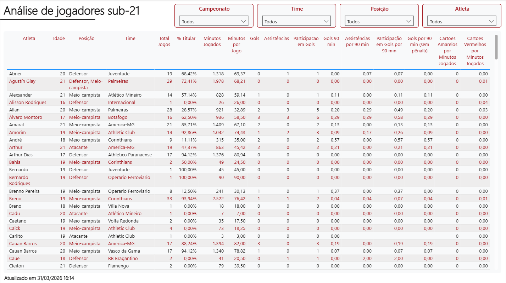
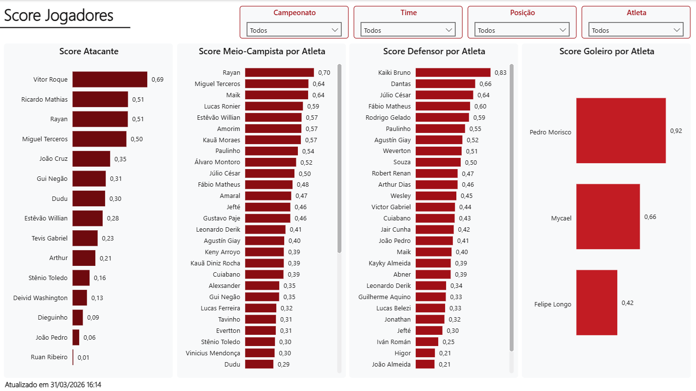
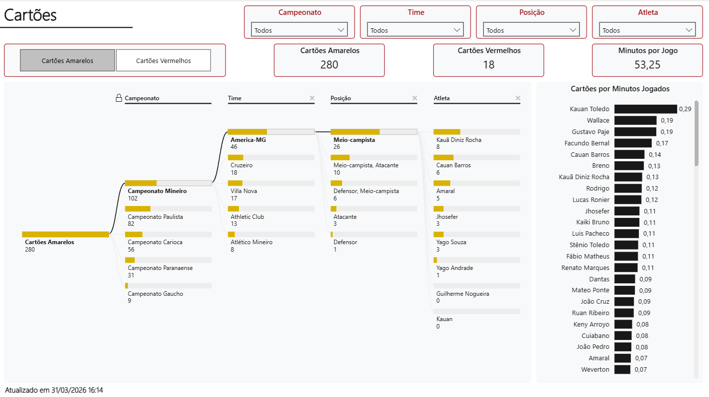

# Análise dos principais jogadores com até 21 anos que atuaram nos 5 principais campeonatos regionais do Brasil no ano de 2025

## Campeonatos regionais
- Carioca
- Gaúcho
- Mineiro
- Paranaense
- Paulista

A seleção dos campeonatos estaduais considerou a relevância histórica, a competitividade das equipes e a participação recorrente de clubes em competições nacionais.

Essa abordagem permite capturar um recorte representativo e equilibrado do futebol brasileiro, contemplando diferentes regiões e níveis de competitividade.

## Fonte de dados
[FBRef Brazil Football Players, Clubs, Leagues and more](https://fbref.com/en/country/BRA/Brazil-Football)

### Extração de dados

- Para a coleta das informações foi utilizada a técnica de *web scraping* com linguagem Python e está disponível no arquivo `scraper_fbref.ipynb`

- O tratamento dos dados foi realizado dentro do código

- As tabelas resultantes foram salvas no formato *csv* e estão disponíveis para consulta no repositório

- A tabela final com as estatísticas dos jogadores também foram inseridas em um banco de dados MySQL dentro de container Docker a fim de facilitar consultas e envio para o Power BI

- As análises finais estão disponíveis no arquivo `dash_teste_athletico_analista_dados.pbix`

***
### Dicionário de dados - Estatísticas FBRef 2025

#### Identificação e perfil

- time: Nome do clube de origem do jogador conforme o banco de dados

- nome: Nome completo do atleta

- posicao: Posição principal do jogador em campo

- idade: Idade do jogador em 2025

#### Tempo de jogo

- qt_jogos: Número total de partidas em que o jogador entrou em campo (como titular ou reserva)

- qt_jogos_titular: Número de partidas em que o jogador começou entre os 11 iniciais

- minutos_jogados: Total de minutos que o atleta esteve em campo durante a temporada

- minutos_jogados_divid_90: Representa o total de minutos dividido por 90

#### Performance técnica

- gols: Total de gols marcados pelo jogador

- assistencias: Total de passes que resultaram diretamente em gol

- participacoes_gols: Soma direta de Gols + Assistências

- gols_nao_penalti: Gols marcados em bola rolando ou falta direta (exclui pênaltis)

- gols_penalti: Gols marcados especificamente em cobranças de pênalti

- chutes_penalti: Total de pênaltis batidos (convertidos ou não)

- cartoes_amarelo: Total de cartões amarelos recebidos

- cartoes_vermelho: Total de cartões vermelhos recebidos

#### Médias normalizadas (Estatísticas por 90 minutos)

Nota: Estas colunas são cruciais para comparar jogadores que jogaram tempos diferentes

- gols_90: Média de gols marcados a cada 90 minutos de jogo

- assistencias_90: Média de assistências a cada 90 minutos de jogo

- participacoes_gols_90: Média de (Gols + Assistências) a cada 90 minutos

- gols_nao_penalti_90: Média de gols (excluindo pênaltis) a cada 90 minutos

- participacoes_gols_e_penalti_90: Média de (Gols + Assistências - Pênaltis) a cada 90 minutos Útil para avaliar a produtividade real sem o "desvio" dos batedores de pênalti oficiais

***
## Principais limitações encontradas durante o processo

### Coleta de dados

- Durante o processo de *scraping* a fonte de dados apresentou o erro 403, o que indica que o servidor bloqueou  as requisições

- Para solucionar o problema foi utilizado o auxílio de modelos de linguagem LLM como o ChatGPT,  Claude e Gemini

- Após análise e teste das sugestões de código a versão final foi implementada e, assim, foi possível contornar o bloqueio do FBref e coletar os dados necessários

### Resultado das coletas

- Notou-se que em alguns times que participaram dos campeonatos regionais escolhidos não havia informações sobre a temporada 2025. Por essa razão estas equipes precisaram ser desconsideradas da análise

- Também houve situações de duplicidade de jogadores, mas entendeu-se que o motivo foi a troca de time durante a temporada. Sendo assim, é possível encontrar duplicidade de atletas no *dashboard*, mas com indicação da respectiva equipe

***

## Proposta de como transformar essa análise em um dashboard recorrente
- A fim de tornar o *dashboard* uma ferramenta atualizada e com informações confiáveis algumas possibilidades são:

    - Investir em uma API como a disponibilizada pela https://www.api-football.com/

    - Implementar um fluxo completo de dados para extração (API / scraping), ETL, carga no banco de dados

    - Criar uma rotina de coleta automatizada com cron ou workflow do n8n

    - Criar logs de execução contendo métricas como tempo de coleta, volume de dados e falhas
